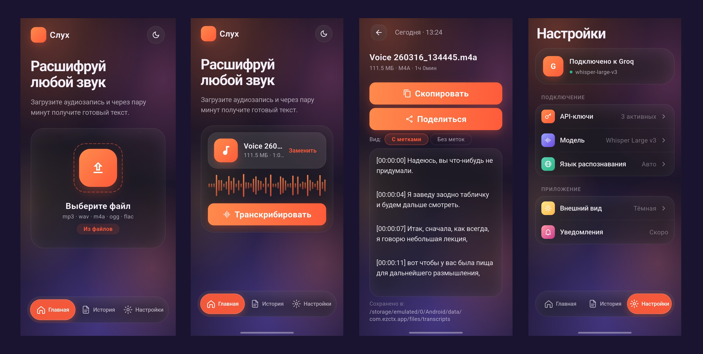

# ezctx

Расшифровка аудио в текст на Android через Groq Whisper API.

Записал лекцию на телефон — открыл ezctx — через несколько минут получил готовый текст в буфере обмена. Без перегона жирного аудио на компьютер, без своего сервера-посредника: запрос идёт напрямую с твоего телефона в Groq.

Ключ и история транскрипций хранятся локально на устройстве в защищённом хранилище. Между тобой и Groq нет ничьего бэкенда.

## Как получить Groq API-ключ

ezctx использует [Groq Whisper API](https://console.groq.com/) для расшифровки. У Groq есть бесплатный тариф, которого хватает для личного использования: лимиты считаются по количеству запросов в минуту и по минутам аудио в сутки, банковская карта при регистрации **не нужна**.

Пошагово:

1. Зайди на [console.groq.com](https://console.groq.com/keys) и зарегистрируйся (через Google/GitHub или email).
2. Нажми **Create API Key**, дай ключу любое имя (например, `ezctx`) и подтверди.
3. Скопируй ключ — он показывается **только один раз**, после закрытия окна его уже не увидеть.
4. Открой ezctx → нижний таб **Настройки** → **API-ключи** → **Добавить ключ**.
5. Вставь скопированный ключ и сохрани.
6. Готово — на главном экране выбирай аудиофайл и жми **Транскрибировать**.

Если запрос упирается в лимит, можно завести несколько ключей с разных аккаунтов — ezctx умеет переключаться между ними автоматически.

## Лицензия

GPL-3.0 — см. файл [LICENSE](LICENSE).

## Контакты

- Email — [koskriv2006@gmail.com](mailto:koskriv2006@gmail.com)
- Баги и предложения — [GitHub Issues](https://github.com/fUS1ONd/ezctx/issues)
